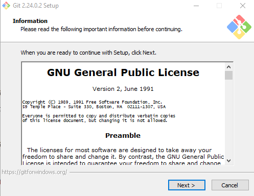
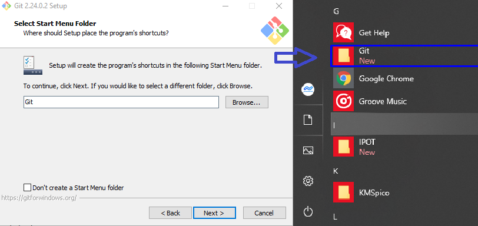
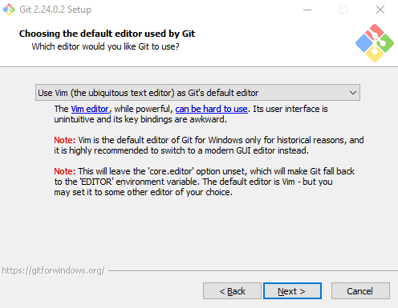
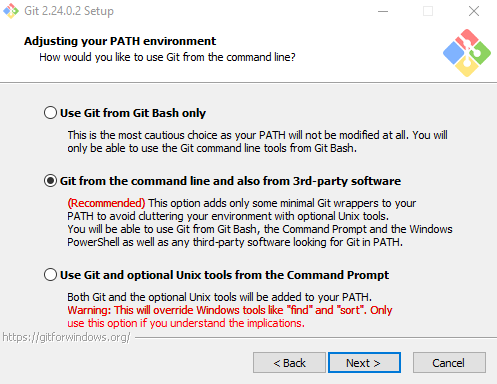
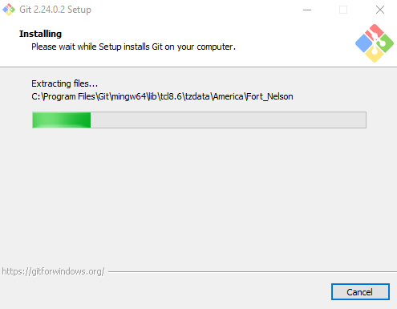

 # tugas-program
 ## Belajar tag dasar HTML yuk

 ### Membuat paragraf
 Berikut langkah - langkah pengunaan Git'
'
 Cara Install Git di Windows
Cara install Git di Windows terdiri dari 10 langkah. Berikut adalah penjelasannya:

1. Download File Git
Untuk menginstall Git, Anda perlu mengunduh file-nya terlebih dahulu di situs resminya. Download sesuai tipe sistem operasi pada komputer Anda. Apabila tipe sistem operasi komputer Anda 64bit,  pilih Git yang mendukung Windows 64bit. Tujuannya adalah agar tidak terjadi error saat proses instalasi Git.
 
2. Install Git
Setelah selesai mengunduh file Git, buka setup aplikasi Git untuk memulai proses instalasi. Halaman awal setelah Anda membuka setup aplikasi Git adalah tampilan Document License dari Git. Klik Next untuk melanjutkan instalasi.'
'
 
3. Tentukan Lokasi Instalasi Git
Selanjutnya, pilih lokasi untuk install Git pada komputer Anda. Pada tutorial ini kami menginstall di lokasi C:\Program Files\Git. Setelah menentukan lokasi instalasi Git, klik Next untuk melanjutkan .'
'
 
 4. Pilih Komponen Tambahan
Kemudian pilih komponen tambahan untuk install Git. Fungsi komponen ini adalah untuk memperlancar penggunaan Git dan mendukung file dengan kapasitas besar. Sesuaikan komponen tambahan yang dipilih seperti pada gambar di bawah ini. Jika sudah klik Next untuk melanjutkan instalasi.'
'
 
5. Tentukan Nama Aplikasi Git
Sebenarnya Anda bebas mengganti nama aplikasi Git yang akan ditampilkan pada Start Menu. Akan tetapi, demi kemudahan saat mencari aplikasi ini, sebaiknya gunakan nama Git saja.'
'
   
 6. Tentukan File Editor
Untuk mengedit script melalui Git, Anda memerlukan file editor. Anda bebas menggunakan file editor apa pun untuk dikombinasikan dengan Git. Pada tutorial ini, kami menggunakan Vim Editor. Klik Next apabila Anda sudah menentukan file editor yang akan Anda gunakan.'
'
 
 7. Kalian bisa langsung next saja sampai menemukan klik install dan pilih Enable.'
'
 

